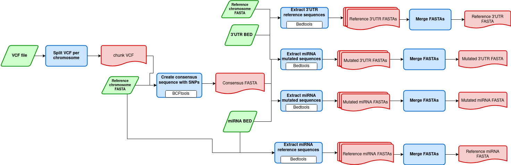

# nf-extract-miRNA-and-UTR-FASTAs

Nextflow pipeline that create a consensus FASTA sequence from VCF file
and extract the reference and mutated miRNA and 3'UTR sequences.

------------------------------------------------------------------------

### Workflow overview

------------------------------------------------------------------------

## Requirements

#### Compatible OS\*:

-   [Ubuntu 20.04]

#### Software:

|                    Requirement                     |          Version           | Required Commands \* |
|:--------------------------------------------------:|:--------------------------:|:--------------------:|
|  [Plan9 port](https://github.com/9fans/plan9port)  | Latest (as of 10/01/2019 ) |       mk \*\*        |
|                      nextflow                      |        21.04.2.5558        |        run\*         |
|          [R](https://www.r-project.org/)           |           3.4.4            |     See R scripts    |
| [Python](https://www.python.org/downloads/source/) |           3.6.9            |  See python scripts  |
|                      bcftools                      |           1.10.2           |    view, index\*     |
|                      bedtools                      |           2.27.1           |      getfasta\*      |
|                       bgzip                        |          1.10.2-3          |       bgzip\*        |

\* These commands must be accessible from your `$PATH` (*i.e.* you
should be able to invoke them from your command line).

\*\* Plan9 port builds many binaries, but you ONLY need the `mk` utility
to be accessible from your command line.

### Installation

Download compare-miRNA-pairs.nf from Github repository:

    git clone 

------------------------------------------------------------------------

#### Test

To test compare-miRNA-pairs.nf execution using test data, run:

    ./runtest.sh

Your console should print the Nextflow log for the run, once every
process has been submitted, the following message will appear:

     ======
     Basic pipeline TEST SUCCESSFUL
     ======

compare-miRNA-pairs.nf results for test data should be in the following
file:

    nf-extract-mirna-and-UTR-FASTAs/test/results/

------------------------------------------------------------------------

### Usage

To run compare-miRNA-pairs go to the pipeline directory and execute:

    nextflow run extract-sequences.nf --mirnabed <path to input 1> --utrbed <path to input 2>
      --vcf <path to input 3> --fasta <path to input >   [--output_dir path to results ]

For information about options and parameters, run:

    nextflow run extract-sequences.nf --help

------------------------------------------------------------------------

#### References

#### Autors

José Eduardo García López
